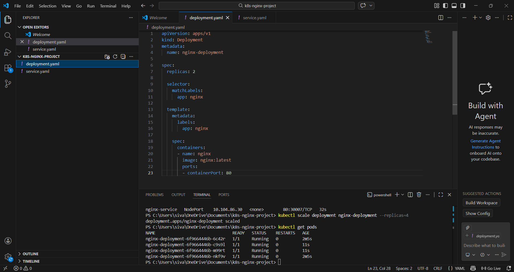
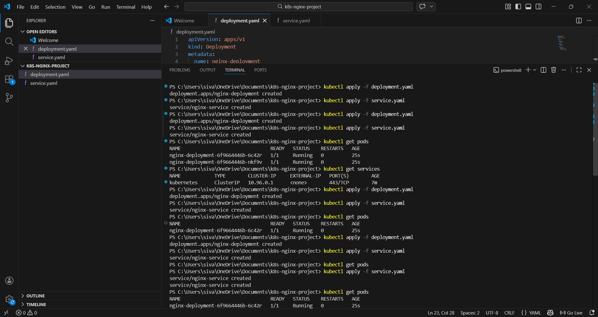
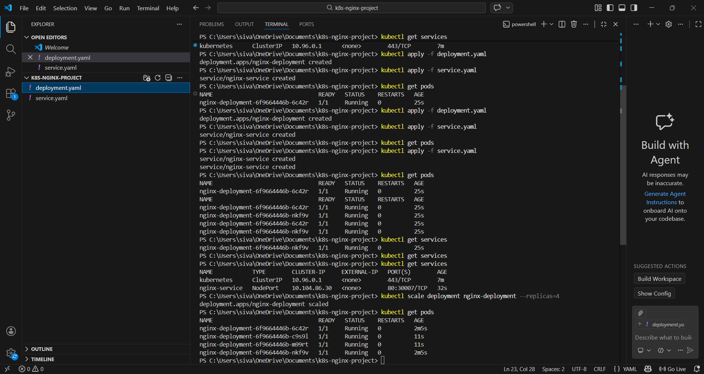
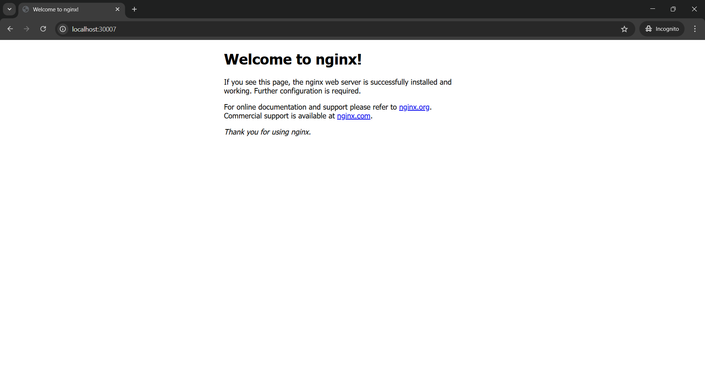

# Kubernetes Nginx Deployment Project

This is a simple Kubernetes project where I deployed an Nginx web server using Kubernetes Deployment and Service.

----

## Project Overview

In this project I practiced the basic Kubernetes concepts:

- Pods
- Deployments
- Services
- Scaling containers

The application is deployed using an Nginx container image and exposed using a NodePort service.

-----

## Files in this Project

deployment.yaml  
Defines the Kubernetes Deployment with multiple replicas of the Nginx container.

service.yaml  
Creates a NodePort Service to expose the Nginx application outside the cluster.

-----

## Commands Used

Create deployment:

kubectl apply -f deployment.yaml

Create service:

kubectl apply -f service.yaml

Check pods:

kubectl get pods

Check services:

kubectl get services

Scale pods:

kubectl scale deployment nginx-deployment --replicas=4

-----

## Screenshots

### Project Folder

### Running Pods

### Service Created

### Nginx Running in Browser

-----

## Technologies Used

- Docker
- Kubernetes
- kubectl
- Nginx
